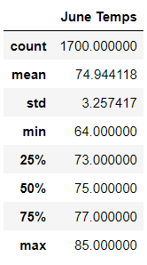
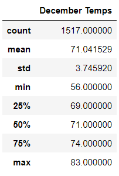

# Surfs_Up Challenge

## Objective
The purpose of this project was to create some strong data to give to investors to back a business centered on surfing. The business' primary goods are surfboards and ice cream, both of which benefit from warmer weather. To show investors that this business is fooldproof, we read weather data and create a summary to prove that this is a profitable and sustainable business. The investor specifically would like to see weather data to see how well it would be sustained. We gathered the weather data for Hawaii in the year 2017 by using the weather database. The database with the weather data is an SQLite database. 

## Results
First I queried the weather database to pull all the data from the month of June by applying a filter. The filter than produced 1700 results, which I then placed into a dataframe and used the describe() function to obtain the following data:

As shown in the summary, we can see that the average temperature in Oahu, Hawaii is approximately 75 degrees (Fahrenheit) with a standard deviation of 3.26 degrees. This tells us that 95% of average daily temperatures are between 69 degrees to 81 degrees. 

We see that in december, the average temperature drops 4 degrees to 71 degrees and there is a slightly larger standard deviation of 3.75. This tells us that 95% of the average daily temperatures are between 65 degrees and 78 degrees.

## Summary
Based on this data, we can assume that this business is sustainable all year round. In the month of June, we see that the temperatures are actually really favorable for surfing. The highest temperature is 85 degrees, which tells us that it doesn't get too hot. It's warm enough where going out won't be an issue and people will want to surf/eat ice cream. Most surfing businesses suffer during the colder months. Looking at the data for december, we see that even at its coldest, it is 56 degrees. This would typically be around night time or early morning. By peak times, we should expect to see good temperatures for surfing and enjoying ice cream. Without a doubt, we have a good prospect for a profitable and sustainable business.